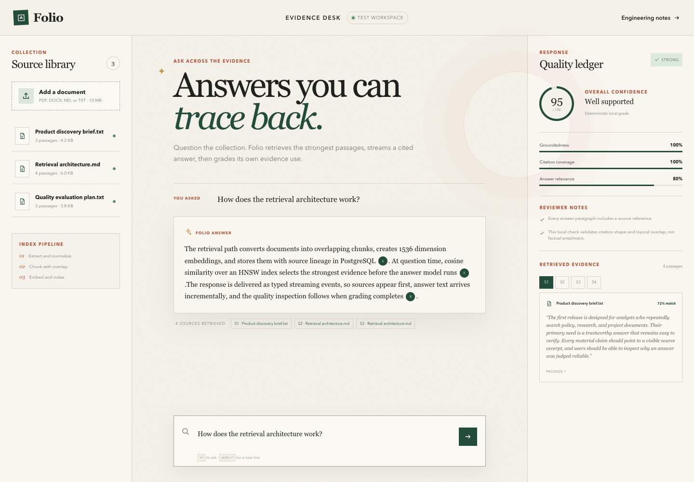

# Folio

Folio is an evidence first document assistant built as a portfolio project. It lets people upload documents, ask questions across them, read streamed answers with source references, and inspect an explicit quality grade.

The project narrative is intentionally accurate: it shows a senior full stack engineer applying existing product and systems experience while developing practical skills in retrieval, model integration, evaluation, and trustworthy AI interaction design. It does not claim long term AI engineering experience.

## Live demonstration

Explore the public workspace at [folio-document-assistant.vercel.app](https://folio-document-assistant.vercel.app).

The public deployment is read only. It demonstrates retrieval, cited generation, and quality inspection with curated portfolio documents while preventing visitors from adding private files. Run the project locally with `ENABLE_PUBLIC_UPLOADS=true` to exercise the complete ingestion path.



Try these questions:

* How does the retrieval architecture work?
* How is response quality evaluated?
* Who is this product designed for?

## What is implemented

* Next.js App Router and strict TypeScript
* PDF, DOCX, Markdown, and text ingestion
* Overlapping chunks with duplicate detection
* OpenAI embeddings stored in PostgreSQL with pgvector
* Cosine retrieval through an HNSW index
* OpenAI Responses API streaming over newline delimited JSON
* Visible source labels connected to retrieved passages
* Structured quality grading with a Zod backed JSON Schema
* Deterministic quality fallback when model grading is unavailable
* Versioned evaluation benchmark and release gate
* Unit and Playwright browser coverage
* Seeded portfolio mode when PostgreSQL is not connected
* Read only public workspace with explicit upload controls

## Run locally

Requirements are Node 20 or later, an OpenAI API key, and PostgreSQL with pgvector for persistent uploads.

```sh
npm install
cp .env.example .env.local
npm run db:migrate
npm run db:verify
npm run dev
```

Without `DATABASE_URL`, the interface uses a clearly labeled seeded corpus. The real OpenAI answer path still runs when `OPENAI_API_KEY` is present. Set `DEMO_MODE=true` for deterministic local and browser testing.

## Verification

```sh
npm run lint
npm test
npm run build
npm run test:e2e
npm run eval
LIVE_EVAL=true npm run eval
```

Evaluation artifacts are written to `output/evals/latest.json`. Browser traces and screenshots are written by Playwright when a case fails.

## Architecture

```text
Browser
  │
  ├── upload → extraction → chunking → embeddings → PostgreSQL and pgvector
  │
  └── question → query embedding → cosine retrieval → evidence prompt
                                                     │
                                                     ├── streamed cited answer
                                                     └── structured quality grade
```

The answer and its evaluation are stored with model, latency, and source lineage. This makes response inspection part of the product rather than a hidden development tool.

## Environment

| Variable | Purpose |
| --- | --- |
| `OPENAI_API_KEY` | Server side OpenAI access |
| `OPENAI_CHAT_MODEL` | Answer model, defaults to `gpt-5-mini` |
| `OPENAI_EVAL_MODEL` | Structured grading model |
| `OPENAI_EMBEDDING_MODEL` | Embedding model, defaults to `text-embedding-3-small` |
| `DATABASE_URL` | PostgreSQL connection string |
| `DIRECT_DATABASE_URL` | Direct PostgreSQL connection used by migrations |
| `DEMO_MODE` | Forces deterministic seeded behavior for tests |
| `ENABLE_PUBLIC_UPLOADS` | Enables document uploads explicitly, disabled by default |

The key is server only. It is never sent to the browser or included in logs.

## Neon database

This workspace is connected to the dedicated Neon project `gentle-water-90176659` in `aws-us-east-1`, using PostgreSQL 17. Runtime requests use the pooled URL and migrations use the direct URL. Both credentials are stored only in the ignored `.env.local` file with restricted permissions.

Use `npm run db:verify` to check the extension, schema, vector dimensions, similarity operator, and persisted record counts without printing credentials. Use `npm run db:rotate:password` if the local role credential must be replaced.

The public library can be replaced with the curated portfolio corpus by running `CONFIRM_PUBLIC_LIBRARY_RESET=RESET npm run db:public:reset`. This command permanently removes existing documents, answers, and evaluations, so inspect the target database before using it.

## Engineering documentation

Read [Engineering decisions](docs/ENGINEERING_DECISIONS.md) for the architecture tradeoffs and [Interview guide](docs/INTERVIEW_GUIDE.md) for an accurate way to present the project.

The OpenAI integration follows the official [Responses API](https://developers.openai.com/api/reference/resources/responses), [embeddings](https://developers.openai.com/api/reference/resources/embeddings), and [evaluation](https://developers.openai.com/api/reference/resources/evals) documentation.
